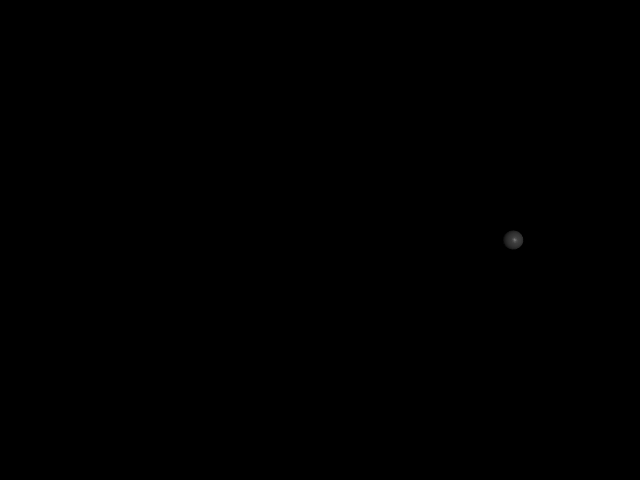
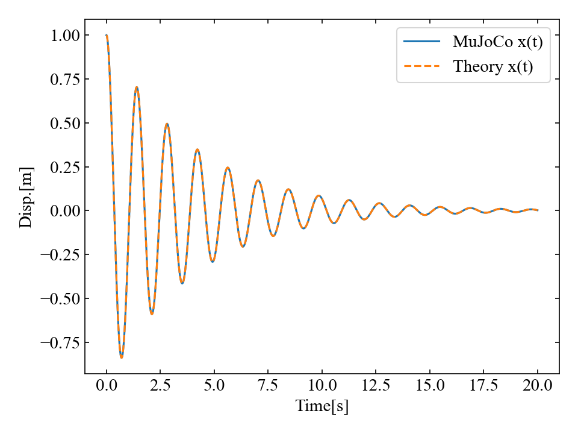
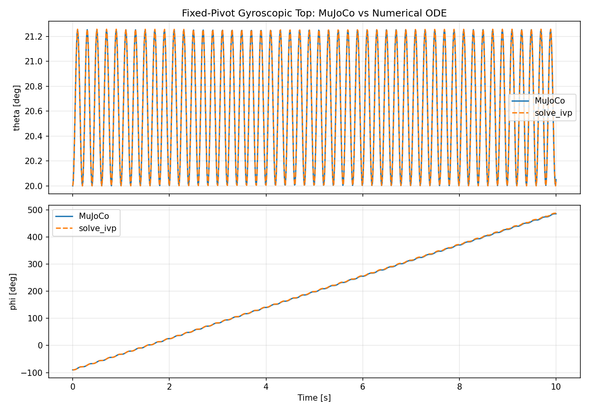
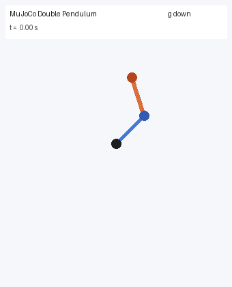
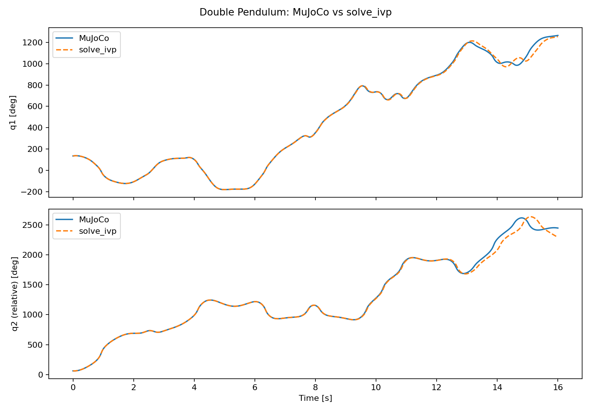
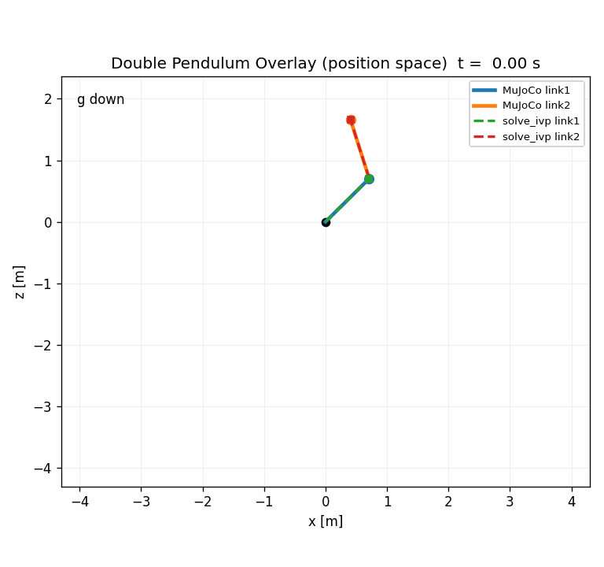

# mujoco-examples

This repository collects MuJoCo examples.  
The goal is not only visualization, but also validating simulation behavior against analytical theory.

## Quick Start

### 1. Activate the virtual environment

```bash
source venv/bin/activate
```

### 2. Install dependencies

```bash
pip install -r requirements.txt
```

### 3. Run the example

```bash
cd src/examples/1dof_spring_mass
python mujoco_1dof_sim.py
```

## Repository Layout

Examples in this repository follow these rules:

- `src/examples/<example_name>/`
- `<example_name>` uses lowercase `snake_case`
- Keep simulation scripts and MJCF files in the same folder

For details, see each example document under `src/examples/<example_name>/Example_*.md`.

## Examples

### 1DOF Spring-Mass-Damper

- Path: `src/examples/1dof_spring_mass/`
- Detailed doc: [`src/examples/1dof_spring_mass/Example_1DOF_Spring-Mass-Damper.md`](src/examples/1dof_spring_mass/Example_1DOF_Spring-Mass-Damper.md)
- Includes:
  - MuJoCo simulation
  - Theory comparison
  - GIF export
  - Matplotlib comparison plot export

Direct link: [1DOF Spring-Mass-Damper Guide](src/examples/1dof_spring_mass/Example_1DOF_Spring-Mass-Damper.md)

### Gyroscopic Rotor Precession

- Path: `src/examples/gyroscopic_rotor/`
- Detailed doc: [`src/examples/gyroscopic_rotor/Example_Gyroscopic-Rotor-Precession.md`](src/examples/gyroscopic_rotor/Example_Gyroscopic-Rotor-Precession.md)
- Scope in this phase:
  - MJCF modeling for gyroscopic precession/whirl
  - GIF video generation with dual-view rendering
  - Fixed-pivot comparison mode (`theta(t)` and `phi(t)`) with `solve_ivp`

Direct link: [Gyroscopic Rotor Precession Guide](src/examples/gyroscopic_rotor/Example_Gyroscopic-Rotor-Precession.md)

### Double Pendulum Chaos

- Path: `src/examples/double_pendulum/`
- Detailed doc: [`src/examples/double_pendulum/Example_Double-Pendulum-Chaos.md`](src/examples/double_pendulum/Example_Double-Pendulum-Chaos.md)
- Scope in this phase:
  - MuJoCo-only pendulum GIF
  - MuJoCo vs `solve_ivp` overlay in position space (GIF)
  - MuJoCo vs `solve_ivp` time-series comparison (PNG)
  - Time-series comparison (`q1`, `q2`)

Direct link: [Double Pendulum Chaos Guide](src/examples/double_pendulum/Example_Double-Pendulum-Chaos.md)

## Outputs

### 1DOF Spring-Mass-Damper Animation (GIF)



### Theory vs MuJoCo



### Gyroscopic Rotor Precession Animation (GIF)


Detailed document: [Gyroscopic Rotor Precession Guide](src/examples/gyroscopic_rotor/Example_Gyroscopic-Rotor-Precession.md)

### Gyroscopic Rotor Comparison Plot



### Double Pendulum Animation (GIF)



### Double Pendulum Comparison Plot



### Double Pendulum Overlay Animation (GIF)



Direct assets:
- [Double Pendulum MuJoCo GIF](src/examples/double_pendulum/animation.gif)
- [Double Pendulum Overlay GIF](src/examples/double_pendulum/comparison_overlay.gif)
- [Double Pendulum Comparison Plot](src/examples/double_pendulum/comparison_plot.png)

## Notes

- Depending on your environment, renderer initialization can fail due to OpenGL/GUI context constraints.
- If that happens, run the example on a local machine with a valid GUI session.
