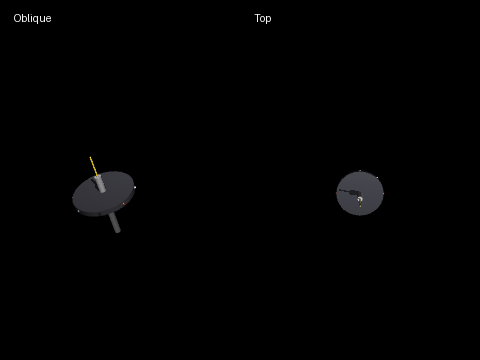

# Gyroscopic Rotor Precession Example

## Purpose

This example visualizes gyroscopic behavior (precession, whirl, and wobble/nutation) of a spinning top-like rotor in MuJoCo.

In this phase, the goal is:

- build a physically plausible contact model
- generate clear animation outputs
- document key dynamics with equations

## Model Summary

The current model is **not a fixed pivot**. It is a free rigid body touching the floor.

- Joint: `freejoint` (6-DOF rigid body motion)
- Contact: tip sphere touches the floor plane with friction
- Gravity: enabled (`0 0 -9.81`)
- Initial condition: small tilt + high spin
- Script option: spin component about body axis is maintained (`HOLD_SPIN_CONSTANT=True`) for visualization stability

This setup allows the top to both rotate and translate on the floor, closer to a real spinning top than a perfectly pinned pivot model.

## MJCF (gyroscopic_rotor.xml)

```xml
<mujoco model="gyroscopic_rotor">
  <compiler angle="degree"/>
  <option gravity="0 0 -9.81" timestep="0.001" integrator="RK4"/>

  <worldbody>
    <geom
      name="floor"
      type="plane"
      size="3 3 0.1"
      material="grid_mat"
      friction="1.2 0.02 0.002"
    />
    <geom name="x_ref" type="capsule" fromto="-4.5 0 0.001 4.5 0 0.001" size="0.004" rgba="0.9 0.2 0.2 1"/>
    <geom name="y_ref" type="capsule" fromto="0 -4.5 0.001 0 4.5 0.001" size="0.004" rgba="0.2 0.6 0.9 1"/>

    <camera name="cam_oblique" pos="4.5 -3.6 2.55" xyaxes="0.62 0.78 0.00 -0.32 0.25 0.91"/>
    <camera name="cam_top" pos="0 0 7.8" xyaxes="1 0 0 0 1 0"/>

    <body name="rotor" pos="0 0 0">
      <freejoint name="free"/>

      <geom
        name="pivot_tip"
        type="sphere"
        pos="0 0 0"
        size="0.014"
        mass="0.02"
        friction="1.2 0.02 0.002"
        rgba="0.1 0.1 0.1 1"
      />
      <geom name="shaft" type="cylinder" pos="0 0 0.16" size="0.015 0.16" mass="0.14" material="metal"/>
      <geom name="rotor_disk" type="cylinder" pos="0 0 0.23" size="0.14 0.012" mass="0.28" rgba="0.25 0.25 0.28 1"/>
      <geom name="axis_marker" type="capsule" fromto="0 0 0 0 0 0.42" size="0.004" mass="0.005" rgba="1.0 0.85 0.1 1"/>
    </body>
  </worldbody>
</mujoco>
```

## Equations of Motion

### Contact Visualization Model (`gyroscopic_rotor.xml`)

For the floor-contact model (`freejoint`), translational and rotational equations are:

$$
m\ddot{r} = m g + f_{\mathrm{contact}}
$$

$$
I\dot{\omega} + \omega \times (I\omega) = \tau_{\mathrm{contact}} + \tau_g
$$

$$
\tau_g = r_{\mathrm{cm}} \times (m g)
$$

This is used for rich visual behavior (precession + slip/whirl under contact).

### Comparison Model (`gyroscopic_rotor_fixed_pivot.xml`)

The theory/numerical comparison uses a fixed-pivot rigid body (no contact), with body-frame angular velocity `\omega_b`:

$$
I_{\mathrm{pivot}}\dot{\omega}_b + \omega_b \times \left(I_{\mathrm{pivot}}\omega_b\right) = \tau_b
$$

$$
\tau_b = R(q)^{\mathsf T} \left( \left(R(q)r_{\mathrm{cm},b}\right) \times \left[0,0,-mg\right]^{\mathsf T} \right)
$$

Quaternion kinematics in the comparison script:

$$
\dot{q} = \frac{1}{2} q \otimes [0,\omega_b]
$$

Transverse inertia is converted from COM to pivot by the parallel-axis theorem:

$$
I_{1,\mathrm{pivot}} = I_{1,\mathrm{com}} + ml^2,\quad I_{3,\mathrm{pivot}} = I_{3,\mathrm{com}}
$$

## Why Gyroscopic Precession Appears

Angular momentum is

$$
L = I\omega
$$

and its rate of change is driven by external torque:

$$
\dot{L} = \tau
$$

When the rotor spins fast, `|L|` is large. Gravity/contact torques tend to rotate the direction of `L` rather than instantly collapsing the axis, producing precession-like motion.

For an idealized symmetric top with a fixed point and steady spin, a common approximation is:

$$
\Omega_p \approx \frac{m g l}{I_3\,\omega_s}
$$

where:

- `\Omega_p`: precession rate
- `l`: distance from pivot to center of mass
- `I_3`: moment of inertia around spin axis
- `\omega_s`: spin rate around body symmetry axis

Notes for this example:

- The simulation includes floor contact and possible slip, so motion is richer than the ideal fixed-point formula.
- With `HOLD_SPIN_CONSTANT=True`, the body-axis spin is regulated in code, so `\omega_s` is intentionally controlled for stable visualization.

## Relation to This Implementation

- XML model: `gyroscopic_rotor.xml`
  - floor friction + tip contact
  - freejoint rigid body
  - colored markers for spin direction readability
- Python script: `mujoco_gyroscopic_rotor_sim.py`
  - sets initial tilt and spin
  - optionally enforces constant spin component along body axis
  - renders two camera views (oblique + top)
  - exports PNG frames and `animation.gif`

## Run

```bash
cd src/examples/gyroscopic_rotor
../../../venv/bin/python mujoco_gyroscopic_rotor_sim.py
```

## Generated Files

- `animation.gif`: side-by-side animation (oblique and top views)
- `img/*.png`: sequential frames used to build the GIF
- `comparison_animation.gif`: fixed-pivot comparison run animation (oblique + top)
- `comparison_plot.png`: `theta(t)` and `phi(t)` overlay (MuJoCo vs numerical ODE, fixed-pivot mode)

## Output Preview

### Animation (GIF)


### Comparison Animation (Fixed Pivot)



### Comparison Plot (Fixed Pivot)


## Comparison Mode (Theory/Numerical vs MuJoCo)

This repository now also includes a **validation path** for waveform comparison:

- MuJoCo model: `gyroscopic_rotor_fixed_pivot.xml`
- Script: `mujoco_gyroscopic_rotor_compare.py`
- Numerical solver: `scipy.integrate.solve_ivp`
- Waveforms: `theta(t)` and `phi(t)`

Assumptions in this comparison mode:

- fixed pivot (`ball` joint), no floor contact/friction
- explicit inertial parameters (`m`, `I1_com`, `I3_com`, COM offset `l`)
- no spin-hold control in dynamics equations

Important consistency rules used in `mujoco_gyroscopic_rotor_compare.py`:

- MuJoCo and `solve_ivp` use the same initial angular velocity definition (`omega_s0` about body axis, optional `omega_p0` mapped consistently).
- ODE uses fixed-pivot transverse inertia converted by the parallel-axis theorem:

$$
I_{1,\mathrm{pivot}} = I_{1,\mathrm{com}} + ml^2,\quad I_{3,\mathrm{pivot}} = I_{3,\mathrm{com}}
$$

This comparison mode is intentionally separate from the contact demo model (`gyroscopic_rotor.xml`).
It is the minimum setup for reproducible theory-vs-MuJoCo overlay.

Run command:

```bash
cd src/examples/gyroscopic_rotor
../../../venv/bin/python mujoco_gyroscopic_rotor_compare.py
```

The script prints RMSE metrics for both waveforms:

- `RMSE theta [deg]`
- `RMSE phi [deg]`

It also exports:

- `img_compare/*.png`
- `comparison_animation.gif`

At the end of execution, the comparison figure is shown with `matplotlib`:

```python
plt.show()
```

If OpenGL/GUI is unavailable (headless environment), GIF rendering may be skipped.

## Notes

- This document now includes baseline dynamics and gyroscopic equations.
- Full theory-to-simulation quantitative validation (error metrics/plots) can be added in a later phase.

---

Back to: [Main README](../../../README.md)
